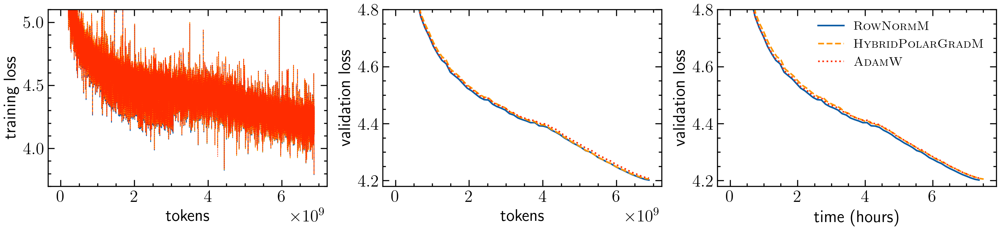
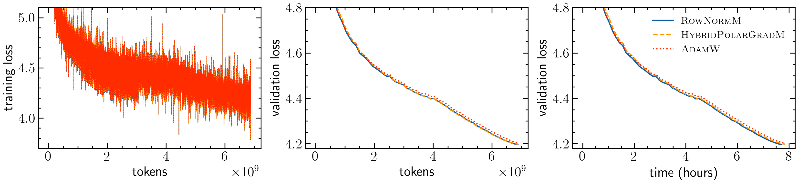
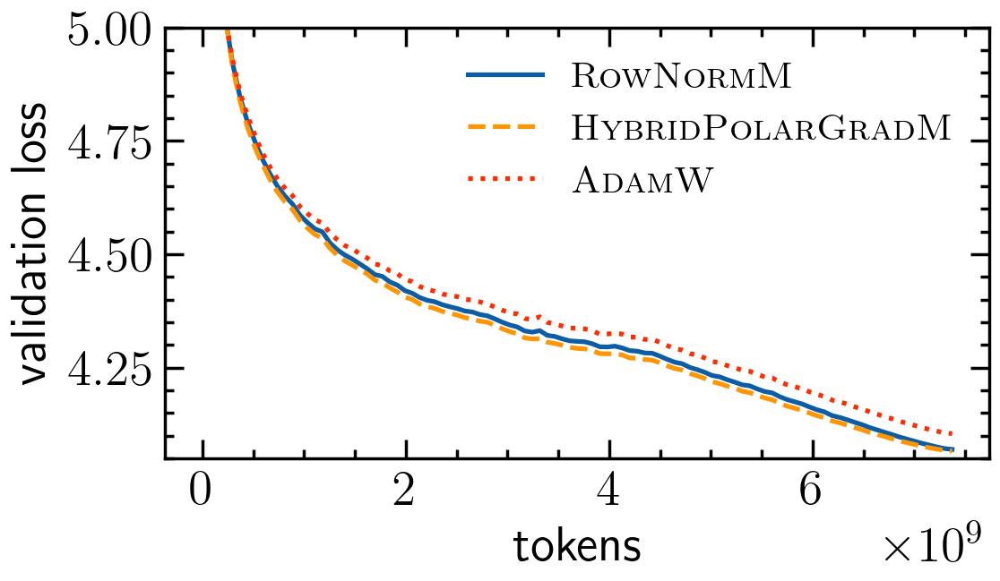
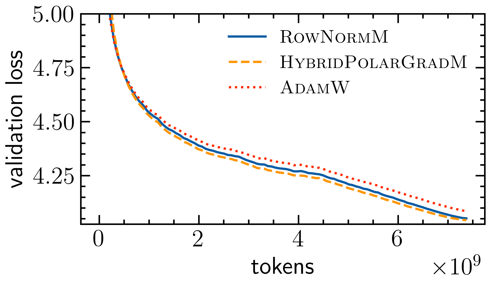
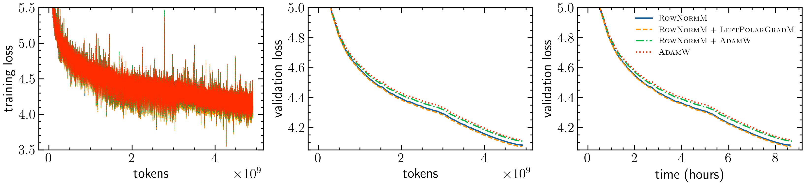
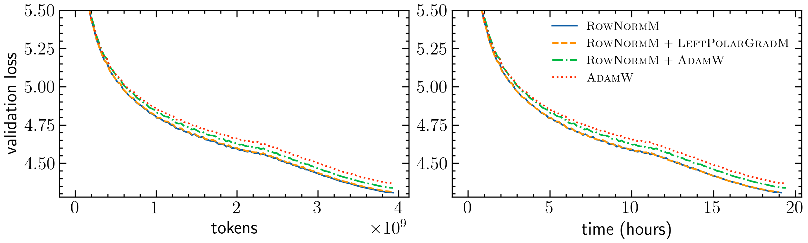

# Symmetry-Compatible Principle for Optimizer Design: Embeddings, LM Heads, SwiGLU MLPs, and MoE Routers

This is a code repository for the paper [Symmetry-Compatible Principle for Optimizer Design: Embeddings, LM Heads, SwiGLU MLPs, and MoE Routers](https://arxiv.org/abs/2605.18106) (Lau and Su, 2026), which proposes a family of *equivariant optimizers* for matrix-valued parameters in neural networks based on a principle based on geometry, symmetry and equivariance.


## Overview
This repository provides implementations of all symmetry-compatible optimizers as described in the paper in PyTorch, as well as the training scripts for the experiments conducted in the paper.


## Repository Organization
The repository is organized around two main concerns: optimizer implementations in `optim/`, and experiment scripts for reproducing the language-model pre-training runs described in the paper.

- `train_qwen3.py`, `train_gemma3_1b.py`, `train_olmoe.py`, and `train_gpt-oss.py` are model-specific training entry points. They wire model loading, dataset paths, distributed training, logging, and optimizer selection for each experiment family.
- `data/` contains dataset preparation utilities. The `cached_finewebedu10B-*.py` scripts download pre-tokenized binary datasets for the supported model families, while `hf_dataset_to_bin.py` converts a HuggingFace dataset into the binary shard format expected by the training scripts.
- `fig/` stores figures and visual assets used alongside the paper and documentation.
- `optim/` is the core library in this repository. It contains the symmetry-compatible optimizers themselves, plus the matrix operations and routing helpers needed to apply them to different parameter types.

Within `optim/`, the code is split by responsibility rather than by model:

- `optim/rightpolargrad.py` implements right-polar-gradient matrix optimizers, including the Gram-Newton-Schulz-backed variant exported as `RightPolarGradM_GramNS`.
- `optim/leftpolargrad.py` implements the left-polar-gradient variant used when the geometry is defined on row space instead of column space.
- `optim/rownorm.py` implements `RowNormM`, a momentum row-normalization optimizer for matrix and batched expert tensors, including orientation-aware handling for transposed and MoE layouts.
- `optim/hybrid.py` implements the hybrid optimizers that combine polar orthogonalization with row scaling, including exact and Gram-Newton-Schulz-based versions and backward-compatible batched-expert wrappers.
- `optim/muon_heads.py` implements a Muon-style optimizer that applies Polar Express head-wise for attention projections and supports MoE expert layouts.
- `optim/polar_express.py` contains the compiled Polar Express orthogonalization kernels, including head-aware reshaping helpers for q/k/v and output projections.
- `optim/invsqrt.py` provides symmetric matrix inverse-square-root routines used by the polar-based optimizers.
- `optim/row_ops.py` contains low-level row-scaling primitives shared by `RowNormM` and the hybrid optimizers.
- `optim/routing.py` builds mixed optimizers and transformer parameter groups, so embeddings, LM heads, dense MLP weights, routers, and expert tensors can each be assigned the appropriate optimizer.
- `optim/utils.py` provides shared utilities such as decoupled weight decay, router centering helpers, and attention or expert layout configuration builders.
- `optim/__init__.py` re-exports the public optimizer API so training scripts can import the package from a single place.


## Installation of Required Libraries
Clone this repository and install the required libraries using pip. We use TensorBoard for logging and visualization, and HuggingFace Transformers and Datasets for language model pre-training experiments. We also install the PyTorch nightly build to ensure compatibility with the latest features and optimizations. For the Gram Newton-Schulz kernels used in the RightPolarGradM_GramNS variant of PolarGradM, we install the `gram-newton-schulz` package from GitHub, which currently resolves its own torch build, so we force the torch stack back onto a CUDA 12.8 nightly afterwards to keep it aligned with the local driver.


```bash
git clone https://github.com/timlautk/equivariant_optimizers.git 
cd equivariant_optimizers

pip install -U numpy typing-extensions tensorboard jsonargparse transformers datasets huggingface-hub 

# Install Gram Newton-Schulz kernels for RightPolarGradM_GramNS.
# This currently resolves its own torch build, so force the torch stack back
# onto a CUDA 12.8 nightly afterwards to keep it aligned with the local driver.
pip install -U git+https://github.com/Dao-AILab/gram-newton-schulz.git
pip install -U --force-reinstall --pre torch torchvision torchaudio --index-url https://download.pytorch.org/whl/nightly/cu128
```

## Datasets
First, set your HuggingFace tokens for faster downloading of the datasets. You can obtain your HuggingFace token from your HuggingFace account settings page. Once you have your token, set it as an environment variable using the following command in your terminal, replacing `hf_your_token_here` with your actual token.

```bash
export HF_TOKEN=hf_your_token_here
```
Download the pre-processed datasets for the language model pre-training experiments using the following commands. These scripts will download the tokenized datasets in a binary format suitable for training from HuggingFace.

```bash
python data/cached_finewebedu10B-qwen3.py

python data/cached_finewebedu10B-gemma3.py

python data/cached_finewebedu10B-olmoe.py

python data/cached_finewebedu10B-gpt-oss.py
```
Alternatively, you can also run the following command to directly convert the HuggingFace datasets into the binary format for training. Make sure to replace the dataset name, config, text column, tokenizer, output directory, and cache directory with your own values.
```bash
python data/hf_dataset_to_bin.py \
    --dataset HuggingFaceFW/fineweb-edu \
    --dataset-config sample-10BT \
    --split train \
    --text-column text \
    --tokenizer Qwen/Qwen3-0.6B \
    --output-dir "your_data_dir/fineweb_edu_10B_Qwen3" \
    --cache-dir your_hf_cache_dir/ \
    --val-first-shard 
```


## Usage
For pre-training experiments, you can run the following commands to start the training. You might need to adjust the paths to the datasets, model checkpoints, and output directories according to your setup. You might also want to adjust the training hyperparameters such as learning rates, batch sizes, and number of training steps according to your computational resources and requirements. The current setup is designed to run on 8 H200 GPUs, and the training scripts use PyTorch's `torchrun` utility for distributed training.

The training scripts will log the training progress and results to TensorBoard, which you can visualize using the `tensorboard` command in your terminal. 


### Qwen3-0.6B-Style Pre-training
Figure 3 in paper shows the training curves for the Qwen3-0.6B-style pre-training runs comparing different optimizer configurations. The following commands reproduce the training runs for each optimizer configuration as shown in the figure.


(a) SwiGLU MLP projection matrices use Muon, equivalently RightPolarGradM with $\alpha = 0$.


(b) SwiGLU MLP projection matrices use HybridPolarGradM with a row-norm/right-spectral composition.

```bash
## RowNormM for embedding and LM head, HybridPolarGradM for MLP up and down projections.
torchrun --standalone --nproc_per_node=8 train_qwen3.py --data_dir=fineweb_edu_10B_Qwen3 \
--num_hidden_layers=20 --device_batch_size=28 --seq_len=1024 \
--embed_optimizer=row --lm_head_optimizer=row --mlp_up_gate_optimizer=hybrid \
--mlp_down_optimizer=hybrid \
--lr=5e-2 --lr_muon=2e-2 --lr_embed=5e-1 --lr_lm_head=5e-3 \
--beta_embed=0.95 --beta_lm_head=0.95 \
--train_steps=30_000 --val_loss_every=500 --val_tokens=10_551_296 \
--inner_steps=5 --eps=1e-8 --alpha=1.0 --tensorboard=True --seed=42

## HybridPolarGradM for embedding and LM head, HybridPolarGradM for MLP up and down projections.
torchrun --standalone --nproc_per_node=8 train_qwen3.py --data_dir=fineweb_edu_10B_Qwen3 \
--num_hidden_layers=20 --device_batch_size=28 --seq_len=1024 \
--embed_optimizer=hybrid --lm_head_optimizer=hybrid --mlp_up_gate_optimizer=hybrid \
--mlp_down_optimizer=hybrid \
--lr=5e-2 --lr_muon=2e-2 --lr_embed=1e0 --lr_lm_head=1e-2 \
--beta_embed=0.95 --beta_lm_head=0.95 \
--train_steps=30_000 --val_loss_every=500 --val_tokens=10_551_296 \
--inner_steps=5 --eps=1e-8 --alpha=1.0 --tensorboard=True --seed=42

## AdamW for embedding and LM head, HybridPolarGradM for MLP up and down projections.
torchrun --standalone --nproc_per_node=8 train_qwen3.py --data_dir=fineweb_edu_10B_Qwen3 \
--num_hidden_layers=20 --device_batch_size=28 --seq_len=1024 \
--lm_head_optimizer=adamw --embed_optimizer=adamw --mlp_up_gate_optimizer=hybrid \
--mlp_down_optimizer=hybrid \
--lr=5e-2 --lr_muon=2e-2 --lr_embed=1e-1 --lr_lm_head=1e-3 \
--train_steps=30_000 --val_loss_every=500 --val_tokens=10_551_296 \
--inner_steps=5 --eps=1e-8 --alpha=1.0 --tensorboard=True --seed=42


## RowNormM for embedding and LM head, Muon for MLP up and down projections.
torchrun --standalone --nproc_per_node=8 train_qwen3.py --data_dir=fineweb_edu_10B_Qwen3 \
--num_hidden_layers=20 --device_batch_size=28 --seq_len=1024 \
--embed_optimizer=row --lm_head_optimizer=row --mlp_up_gate_optimizer=matrix \
--mlp_down_optimizer=matrix \
--lr=5e-2 --lr_muon=2e-2 --lr_embed=5e-1 --lr_lm_head=5e-3 \
--beta_embed=0.95 --beta_lm_head=0.95 \
--train_steps=30_000 --val_loss_every=500 --val_tokens=10_551_296 \
--inner_steps=5 --eps=1e-8 --alpha=1.0 --tensorboard=True --seed=42

## HybridPolarGradM for embedding and LM head, Muon for MLP up and down projections.
torchrun --standalone --nproc_per_node=8 train_qwen3.py --data_dir=fineweb_edu_10B_Qwen3 \
--num_hidden_layers=20 --device_batch_size=28 --seq_len=1024 \
--embed_optimizer=hybrid --lm_head_optimizer=hybrid --mlp_up_gate_optimizer=matrix \
--mlp_down_optimizer=matrix \
--lr=5e-2 --lr_muon=2e-2 --lr_embed=1e0 --lr_lm_head=1e-2 \
--beta_embed=0.95 --beta_lm_head=0.95 \
--train_steps=30_000 --val_loss_every=500 --val_tokens=10_551_296 \
--inner_steps=5 --eps=1e-8 --alpha=1.0 --tensorboard=True --seed=42

## AdamW for embedding and LM head, Muon for MLP up and down projections. 
torchrun --standalone --nproc_per_node=8 train_qwen3.py --data_dir=fineweb_edu_10B_Qwen3 \
--num_hidden_layers=20 --device_batch_size=28 --seq_len=1024 \
--lm_head_optimizer=adamw --embed_optimizer=adamw --mlp_up_gate_optimizer=matrix \
--mlp_down_optimizer=matrix \
--lr=5e-2 --lr_muon=2e-2 --lr_embed=1e-1 --lr_lm_head=1e-3 \
--train_steps=30_000 --val_loss_every=500 --val_tokens=10_551_296 \
--inner_steps=5 --eps=1e-8 --alpha=1.0 --tensorboard=True --seed=42
```

### Gemma 3 1B-Style Pre-training
Part of Figure 4 in paper
<center></center>

(a) SwiGLU MLP projection matrices use Muon, equivalently RightPolarGradM with $\alpha = 0$.

<center></center>

(b) SwiGLU MLP projection matrices use HybridPolarGradM with a row-norm/right-spectral composition.

```bash
## RowNormM for embedding and LM head, HybridPolarGradM for MLP up and down projections.
torchrun --standalone --nproc_per_node=8 train_gemma3_1b.py --data_dir=fineweb_edu_10B_gemma3 \
--num_hidden_layers=18 --device_batch_size=18 --seq_len=1024 \
--embed_optimizer=row --lm_head_optimizer=row --mlp_up_gate_optimizer=hybrid \
--mlp_down_optimizer=hybrid \
--lr=5e-2 --lr_muon=2e-2 --lr_embed=5e-3 --lr_lm_head=5e-3 \
--beta_embed=0.95 --beta_lm_head=0.95 \
--train_steps=50_000 --val_loss_every=500 --val_tokens=10_469_376 \
--inner_steps=5 --eps=1e-8 --alpha=1.0 --tensorboard=True --seed=42

## HybridPolarGradM for embedding and LM head, HybridPolarGradM for MLP up and down projections.
torchrun --standalone --nproc_per_node=8 train_gemma3_1b.py --data_dir=fineweb_edu_10B_gemma3 \
--num_hidden_layers=18 --device_batch_size=18 --seq_len=1024 \
--embed_optimizer=hybrid --lm_head_optimizer=hybrid --mlp_up_gate_optimizer=hybrid \
--mlp_down_optimizer=hybrid \
--lr=5e-2 --lr_muon=2e-2 --lr_embed=1e-2 --lr_lm_head=1e-2 \
--beta_embed=0.95 --beta_lm_head=0.95 \
--train_steps=50_000 --val_loss_every=500 --val_tokens=10_469_376 \
--inner_steps=5 --eps=1e-8 --alpha=1.0 --tensorboard=True --seed=42

## AdamW for embedding and LM head, HybridPolarGradM for MLP up and down projections.
torchrun --standalone --nproc_per_node=8 train_gemma3_1b.py --data_dir=fineweb_edu_10B_gemma3 \
--num_hidden_layers=18 --device_batch_size=18 --seq_len=1024 \
--lm_head_optimizer=adamw --embed_optimizer=adamw --mlp_up_gate_optimizer=hybrid \
--mlp_down_optimizer=hybrid \
--lr=5e-2 --lr_muon=2e-2 --lr_embed=5e-4 --lr_lm_head=5e-4 \
--train_steps=50_000 --val_loss_every=500 --val_tokens=10_469_376 \
--inner_steps=5 --eps=1e-8 --alpha=1.0 --tensorboard=True --seed=42

## RowNormM for embedding and LM head, Muon for MLP up and down projections.
torchrun --standalone --nproc_per_node=8 train_gemma3_1b.py --data_dir=fineweb_edu_10B_gemma3 \
--num_hidden_layers=18 --device_batch_size=18 --seq_len=1024 \
--embed_optimizer=row --lm_head_optimizer=row --mlp_up_gate_optimizer=matrix \
--mlp_down_optimizer=matrix \
--lr=5e-2 --lr_muon=2e-2 --lr_embed=2.5e-3 --lr_lm_head=2.5e-3 \
--beta_embed=0.95 --beta_lm_head=0.95 \
--train_steps=50_000 --val_loss_every=500 --val_tokens=10_469_376 \
--inner_steps=5 --eps=1e-8 --tensorboard=True --seed=42

## HybridPolarGradM for embedding and LM head, Muon for MLP up and down projections.
torchrun --standalone --nproc_per_node=8 train_gemma3_1b.py --data_dir=fineweb_edu_10B_gemma3 \
--num_hidden_layers=18 --device_batch_size=18 --seq_len=1024 \
--embed_optimizer=hybrid --lm_head_optimizer=hybrid --mlp_up_gate_optimizer=matrix \
--mlp_down_optimizer=matrix \
--lr=5e-2 --lr_muon=2e-2 --lr_embed=2.5e-3 --lr_lm_head=2.5e-3 \
--beta_embed=0.95 --beta_lm_head=0.95 \
--train_steps=50_000 --val_loss_every=500 --val_tokens=10_469_376 \
--inner_steps=5 --eps=1e-8 --alpha=1.0 --tensorboard=True --seed=42

## AdamW for embedding and LM head, Muon for MLP up and down projections.
torchrun --standalone --nproc_per_node=8 train_gemma3_1b.py --data_dir=fineweb_edu_10B_gemma3 \
--num_hidden_layers=18 --device_batch_size=18 --seq_len=1024 \
--lm_head_optimizer=adamw --embed_optimizer=adamw --mlp_up_gate_optimizer=matrix \
--mlp_down_optimizer=matrix \
--lr=5e-2 --lr_muon=2e-2 --lr_embed=5e-4 --lr_lm_head=5e-4 \
--train_steps=50_000 --val_loss_every=500 --val_tokens=10_469_376 \
--inner_steps=5 --eps=1e-8 --tensorboard=True --seed=42
```

### OLMoE-1B-7B-Style Pre-training
Figure 5 in paper


```bash
## RowNormM for embedding, LM head and router.
torchrun --standalone --nproc_per_node=8 train_olmoe.py --data_dir=fineweb_edu_10B_OLMoE \
--num_hidden_layers=12 --device_batch_size=20 --seq_len=1024 --num_experts=32 \
--embed_optimizer=row --lm_head_optimizer=row --router_optimizer=row \
--lr=1e-2 --lr_muon=5e-3 --lr_embed=5e-1 --lr_lm_head=5e-3 --lr_router=7.5e-4 \
--beta_embed=0.95 --beta_lm_head=0.95 --beta_router=0.95 \
--train_steps=30_000 --val_loss_every=500 --val_tokens=10_485_760 \
--inner_steps=5 --eps=1e-8 --tensorboard=True --seed=42

## RowNormM for embedding and LM head, LeftPolarGradM for router.
torchrun --standalone --nproc_per_node=8 train_olmoe.py --data_dir=fineweb_edu_10B_OLMoE \
--num_hidden_layers=12 --device_batch_size=20 --seq_len=1024 --num_experts=32 \
--embed_optimizer=row --lm_head_optimizer=row --router_optimizer=left \
--lr=1e-2 --lr_muon=5e-3 --lr_embed=5e-1 --lr_lm_head=5e-3 --lr_router=7.5e-4 \
--beta_embed=0.95 --beta_lm_head=0.95 --beta_router=0.95 \
--train_steps=30_000 --val_loss_every=500 --val_tokens=10_485_760 \
--inner_steps=5 --eps=1e-8 --alpha=1.0 --tensorboard=True --seed=42

## RowNormM for embedding and LM head, AdamW for router.
torchrun --standalone --nproc_per_node=8 train_olmoe.py --data_dir=fineweb_edu_10B_OLMoE \
--num_hidden_layers=12 --device_batch_size=20 --seq_len=1024 --num_experts=32 \
--embed_optimizer=row --lm_head_optimizer=row --router_optimizer=adamw \
--lr=1e-2 --lr_muon=5e-3 --lr_embed=5e-1 --lr_lm_head=5e-3 --lr_router=7.5e-4 \
--beta_embed=0.95 --beta_lm_head=0.95 \
--train_steps=30_000 --val_loss_every=500 --val_tokens=10_485_760 \
--inner_steps=5 --eps=1e-8 --tensorboard=True --seed=42

## AdamW for embedding, LM head and router.
torchrun --standalone --nproc_per_node=8 train_olmoe.py --data_dir=fineweb_edu_10B_OLMoE \
--num_hidden_layers=12 --device_batch_size=20 --seq_len=1024 --num_experts=32 \
--lm_head_optimizer=adamw --embed_optimizer=adamw --router_optimizer=adamw \
--lr=1e-2 --lr_muon=5e-3 --lr_embed=5e-4 --lr_lm_head=5e-4 --lr_router=7.5e-4 \
--train_steps=30_000 --val_loss_every=500 --val_tokens=10_485_760 \
--inner_steps=5 --eps=1e-8 --tensorboard=True --seed=42
```

### Downsized gpt-oss Pre-training
Figure 2 in paper 
<center></center>

```bash
## RowNormM for embedding, LM head and router.
torchrun --standalone --nproc_per_node=8 train_gpt-oss.py --data_dir=fineweb_edu_10B_gpt-oss \
--num_hidden_layers=12 --hidden_size=2048 --device_batch_size=8 --seq_len=1024 --num_experts=16 \
--embed_optimizer=row --lm_head_optimizer=row --router_optimizer=row \
--lr=5e-3 --lr_muon=1e-3 --lr_embed=1e-1 --lr_lm_head=1e-3 --lr_router=7.5e-4 \
--beta_embed=0.95 --beta_lm_head=0.95 --beta_router=0.95 \
--train_steps=60_000 --val_loss_every=500 --val_tokens=10_485_760 \
--inner_steps=5 --eps=1e-8 --tensorboard=True --seed=42

## RowNormM for embedding and LM head, LeftPolarGradM for router.
torchrun --standalone --nproc_per_node=8 train_gpt-oss.py --data_dir=fineweb_edu_10B_gpt-oss \
--num_hidden_layers=12 --hidden_size=2048 --device_batch_size=8 --seq_len=1024 --num_experts=16 \
--embed_optimizer=row --lm_head_optimizer=row --router_optimizer=left \
--lr=5e-3 --lr_muon=1e-3 --lr_embed=1e-1 --lr_lm_head=1e-3 --lr_router=7.5e-4 \
--beta_embed=0.95 --beta_lm_head=0.95 --beta_router=0.95 \
--train_steps=60_000 --val_loss_every=500 --val_tokens=10_485_760 \
--inner_steps=5 --eps=1e-8 --alpha=1.0 --tensorboard=True --seed=42

## RowNormM for embedding and LM head, AdamW for router.
torchrun --standalone --nproc_per_node=8 train_gpt-oss.py --data_dir=fineweb_edu_10B_gpt-oss \
--num_hidden_layers=12 --hidden_size=2048 --device_batch_size=8 --seq_len=1024 --num_experts=16 \
--embed_optimizer=row --lm_head_optimizer=row --router_optimizer=adamw \
--lr=5e-3 --lr_muon=1e-3 --lr_embed=1e-1 --lr_lm_head=1e-3 --lr_router=7.5e-4 \
--beta_embed=0.95 --beta_lm_head=0.95 \
--train_steps=60_000 --val_loss_every=500 --val_tokens=10_485_760 \
--inner_steps=5 --eps=1e-8 --tensorboard=True --seed=42

## AdamW for embedding, LM head and router.
torchrun --standalone --nproc_per_node=8 train_gpt-oss.py --data_dir=fineweb_edu_10B_gpt-oss \
--num_hidden_layers=12 --hidden_size=2048 --device_batch_size=8 --seq_len=1024 --num_experts=16 \
--lm_head_optimizer=adamw --embed_optimizer=adamw --router_optimizer=adamw \
--lr=5e-3 --lr_muon=1e-3 --lr_embed=5e-4 --lr_lm_head=5e-4 --lr_router=7.5e-4 \
--train_steps=60_000 --val_loss_every=500 --val_tokens=10_485_760 \
--inner_steps=5 --eps=1e-8 --tensorboard=True --seed=42
```

#### Load-Balancing Loss and Router z-Loss Diagnostics
##### Without auxiliary losses

```bash
## RowNormM for embedding, LM head and router.
torchrun --standalone --nproc_per_node=8 train_gpt-oss_router_metrics.py --data_dir=fineweb_edu_10B_gpt-oss \
--num_hidden_layers=12 --hidden_size=2048 --device_batch_size=8 --seq_len=1024 --num_experts=16 \
--embed_optimizer=row --lm_head_optimizer=row --router_optimizer=row \
--lr=5e-3 --lr_muon=1e-3 --lr_embed=1e-1 --lr_lm_head=1e-3 --lr_router=7.5e-4 \
--beta_embed=0.95 --beta_lm_head=0.95 --beta_router=0.95 \
--train_steps=60_000 --val_loss_every=500 --val_tokens=10_485_760 \
--inner_steps=5 --eps=1e-8 --tensorboard=True --seed=42 \
--log_router_metrics=True --router_metrics_every=500 --router_metrics_per_layer=True \
--router_metrics_save_npz=True

## RowNormM for embedding and LM head, LeftPolarGradM for router.
torchrun --standalone --nproc_per_node=8 train_gpt-oss_router_metrics.py --data_dir=fineweb_edu_10B_gpt-oss \
--num_hidden_layers=12 --hidden_size=2048 --device_batch_size=8 --seq_len=1024 --num_experts=16 \
--embed_optimizer=row --lm_head_optimizer=row --router_optimizer=left \
--lr=5e-3 --lr_muon=1e-3 --lr_embed=1e-1 --lr_lm_head=1e-3 --lr_router=7.5e-4 \
--beta_embed=0.95 --beta_lm_head=0.95 --beta_router=0.95 \
--train_steps=60_000 --val_loss_every=500 --val_tokens=10_485_760 \
--inner_steps=5 --eps=1e-8 --alpha=1.0 --tensorboard=True --seed=42 \
--log_router_metrics=True --router_metrics_every=500 --router_metrics_per_layer=True \
--router_metrics_save_npz=True

## RowNormM for embedding and LM head, uncentered LeftPolarGradM for router.
torchrun --standalone --nproc_per_node=8 train_gpt-oss_router_metrics.py --data_dir=fineweb_edu_10B_gpt-oss \
--num_hidden_layers=12 --hidden_size=2048 --device_batch_size=8 --seq_len=1024 --num_experts=16 \
--embed_optimizer=row --lm_head_optimizer=row --router_optimizer=left_uncentered \
--lr=5e-3 --lr_muon=1e-3 --lr_embed=1e-1 --lr_lm_head=1e-3 --lr_router=7.5e-4 \
--beta_embed=0.95 --beta_lm_head=0.95 --beta_router=0.95 \
--train_steps=60_000 --val_loss_every=500 --val_tokens=10_485_760 \
--inner_steps=5 --eps=1e-8 --alpha=1.0 --tensorboard=True --seed=42 \
--log_router_metrics=True --router_metrics_every=500 --router_metrics_per_layer=True \
--router_metrics_save_npz=True

## RowNormM for embedding and LM head, HybridPolarGradM for router.
torchrun --standalone --nproc_per_node=8 train_gpt-oss_router_metrics.py --data_dir=fineweb_edu_10B_gpt-oss \
--num_hidden_layers=12 --hidden_size=2048 --device_batch_size=8 --seq_len=1024 --num_experts=16 \
--embed_optimizer=row --lm_head_optimizer=row --router_optimizer=hybrid \
--lr=5e-3 --lr_muon=1e-3 --lr_embed=1e-1 --lr_lm_head=1e-3 --lr_router=7.5e-4 \
--beta_embed=0.95 --beta_lm_head=0.95 --beta_router=0.95 \
--train_steps=60_000 --val_loss_every=500 --val_tokens=10_485_760 \
--inner_steps=5 --eps=1e-8 --alpha=1.0 --tensorboard=True --seed=42 \
--log_router_metrics=True --router_metrics_every=500 --router_metrics_per_layer=True \
--router_metrics_save_npz=True

## RowNormM for embedding and LM head, AdamW for router.
torchrun --standalone --nproc_per_node=8 train_gpt-oss_router_metrics.py --data_dir=fineweb_edu_10B_gpt-oss \
--num_hidden_layers=12 --hidden_size=2048 --device_batch_size=8 --seq_len=1024 --num_experts=16 \
--embed_optimizer=row --lm_head_optimizer=row --router_optimizer=adamw \
--lr=5e-3 --lr_muon=1e-3 --lr_embed=1e-1 --lr_lm_head=1e-3 --lr_router=7.5e-4 \
--beta_embed=0.95 --beta_lm_head=0.95 \
--train_steps=60_000 --val_loss_every=500 --val_tokens=10_485_760 \
--inner_steps=5 --eps=1e-8 --tensorboard=True --seed=42 \
--log_router_metrics=True --router_metrics_every=500 --router_metrics_per_layer=True \
--router_metrics_save_npz=True
```

##### With auxiliary load-balancing losses and router z-losses

```bash
## RowNormM for embedding, LM head and router.
torchrun --standalone --nproc_per_node=8 train_gpt-oss_router_metrics.py --data_dir=fineweb_edu_10B_gpt-oss \
--num_hidden_layers=12 --hidden_size=2048 --device_batch_size=8 --seq_len=1024 --num_experts=16 \
--embed_optimizer=row --lm_head_optimizer=row --router_optimizer=row \
--lr=5e-3 --lr_muon=1e-3 --lr_embed=1e-1 --lr_lm_head=1e-3 --lr_router=7.5e-4 \
--beta_embed=0.95 --beta_lm_head=0.95 --beta_router=0.95 \
--train_steps=60_000 --val_loss_every=500 --val_tokens=10_485_760 \
--inner_steps=5 --eps=1e-8 --tensorboard=True --seed=42 \
--log_router_metrics=True --router_metrics_every=500 --router_metrics_per_layer=True \
--router_metrics_save_npz=True --router_aux_loss_coef=1e-2 --router_z_loss_coef=1e-3

## RowNormM for embedding and LM head, LeftPolarGradM for router.
torchrun --standalone --nproc_per_node=8 train_gpt-oss_router_metrics.py --data_dir=fineweb_edu_10B_gpt-oss \
--num_hidden_layers=12 --hidden_size=2048 --device_batch_size=8 --seq_len=1024 --num_experts=16 \
--embed_optimizer=row --lm_head_optimizer=row --router_optimizer=left \
--lr=5e-3 --lr_muon=1e-3 --lr_embed=1e-1 --lr_lm_head=1e-3 --lr_router=7.5e-4 \
--beta_embed=0.95 --beta_lm_head=0.95 --beta_router=0.95 \
--train_steps=60_000 --val_loss_every=500 --val_tokens=10_485_760 \
--inner_steps=5 --eps=1e-8 --alpha=1.0 --tensorboard=True --seed=42 \
--log_router_metrics=True --router_metrics_every=500 --router_metrics_per_layer=True \
--router_metrics_save_npz=True --router_aux_loss_coef=1e-2 --router_z_loss_coef=1e-3

## RowNormM for embedding and LM head, uncentered LeftPolarGradM for router.
torchrun --standalone --nproc_per_node=8 train_gpt-oss_router_metrics.py --data_dir=fineweb_edu_10B_gpt-oss \
--num_hidden_layers=12 --hidden_size=2048 --device_batch_size=8 --seq_len=1024 --num_experts=16 \
--embed_optimizer=row --lm_head_optimizer=row --router_optimizer=left_uncentered \
--lr=5e-3 --lr_muon=1e-3 --lr_embed=1e-1 --lr_lm_head=1e-3 --lr_router=7.5e-4 \
--beta_embed=0.95 --beta_lm_head=0.95 --beta_router=0.95 \
--train_steps=60_000 --val_loss_every=500 --val_tokens=10_485_760 \
--inner_steps=5 --eps=1e-8 --alpha=1.0 --tensorboard=True --seed=42 \
--log_router_metrics=True --router_metrics_every=500 --router_metrics_per_layer=True \
--router_metrics_save_npz=True --router_aux_loss_coef=1e-2 --router_z_loss_coef=1e-3

## RowNormM for embedding and LM head, HybridPolarGradM for router.
torchrun --standalone --nproc_per_node=8 train_gpt-oss_router_metrics.py --data_dir=fineweb_edu_10B_gpt-oss \
--num_hidden_layers=12 --hidden_size=2048 --device_batch_size=8 --seq_len=1024 --num_experts=16 \
--embed_optimizer=row --lm_head_optimizer=row --router_optimizer=hybrid \
--lr=5e-3 --lr_muon=1e-3 --lr_embed=1e-1 --lr_lm_head=1e-3 --lr_router=7.5e-4 \
--beta_embed=0.95 --beta_lm_head=0.95 --beta_router=0.95 \
--train_steps=60_000 --val_loss_every=500 --val_tokens=10_485_760 \
--inner_steps=5 --eps=1e-8 --alpha=1.0 --tensorboard=True --seed=42 \
--log_router_metrics=True --router_metrics_every=500 --router_metrics_per_layer=True \
--router_metrics_save_npz=True --router_aux_loss_coef=1e-2 --router_z_loss_coef=1e-3

## RowNormM for embedding and LM head, AdamW for router.
torchrun --standalone --nproc_per_node=8 train_gpt-oss_router_metrics.py --data_dir=fineweb_edu_10B_gpt-oss \
--num_hidden_layers=12 --hidden_size=2048 --device_batch_size=8 --seq_len=1024 --num_experts=16 \
--embed_optimizer=row --lm_head_optimizer=row --router_optimizer=adamw \
--lr=5e-3 --lr_muon=1e-3 --lr_embed=1e-1 --lr_lm_head=1e-3 --lr_router=7.5e-4 \
--beta_embed=0.95 --beta_lm_head=0.95 \
--train_steps=60_000 --val_loss_every=500 --val_tokens=10_485_760 \
--inner_steps=5 --eps=1e-8 --tensorboard=True --seed=42 \
--log_router_metrics=True --router_metrics_every=500 --router_metrics_per_layer=True \
--router_metrics_save_npz=True --router_aux_loss_coef=1e-2 --router_z_loss_coef=1e-3
```


## Citation
If you find this repository useful for your research, please consider citing our paper using the BibTeX entry below:
```
@article{lau2026symmetry,
  title={Symmetry-Compatible Principle for Optimizer Design: Embeddings, {LM} Heads, {SwiGLU MLPs}, and {MoE} Routers},
  author={Lau, Tim Tsz-Kit and Weijie Su},
  year={2026},
  journal={arXiv preprint arXiv:2605.18106}
}
```

## References
- Lau, Tim Tsz-Kit, and Weijie Su. [Symmetry-Compatible Principle for Optimizer Design: Embeddings, LM Heads, SwiGLU MLPs, and MoE Routers](https://arxiv.org/abs/2605.18106). *arXiv preprint arXiv:2605.18106*, 2026.

-  Lau, Tim Tsz-Kit, Qi Long, and Weijie Su. [PolarGrad: A class of matrix-gradient optimizers from a unifying preconditioning perspective](https://arxiv.org/abs/2505.21799). *arXiv preprint arXiv:2505.21799*, 2025. 

- Jordan, Keller, Yuchen Jin, Vlado Boza, Jiacheng You, Franz Cesista, Laker Newhouse, and Jeremy Bernstein. [Muon: An optimizer for hidden layers in neural networks](https://kellerjordan.github.io/posts/muon/). 2024. 

- Carlson, David, Volkan Cevher, and Lawrence Carin. [Stochastic spectral descent for restricted Boltzmann machines](https://proceedings.mlr.press/v38/carlson15.html). In
*Proceedings of the International Conference on Artificial Intelligence and Statistics (AISTATS)*, 2015a. 

- Carlson, David E., Edo Collins, Ya-Ping Hsieh, Lawrence Carin, and Volkan Cevher. [Preconditioned spectral descent for deep learning](https://papers.nips.cc/paper_files/paper/2015/hash/f50a6c02a3fc5a3a5d4d9391f05f3efc-Abstract.html). In *Advances in Neural Information Processing Systems (NeurIPS)*, 2015b.

- Amsel, Noah, David Persson, Christopher Musco, and Robert M. Gower. [The Polar Express: Optimal matrix sign methods and their application to the Muon algorithm](https://openreview.net/forum?id=yRtgZ1K8hO). *International Conference on Learning Representations (ICLR)*, 2026.

- Zhang, Jack, Noah Amsel, Berlin Chen, and Tri Dao. [Gram Newton-Schulz](https://dao-ailab.github.io/blog/2026/gram-newton-schulz/). 2026. 